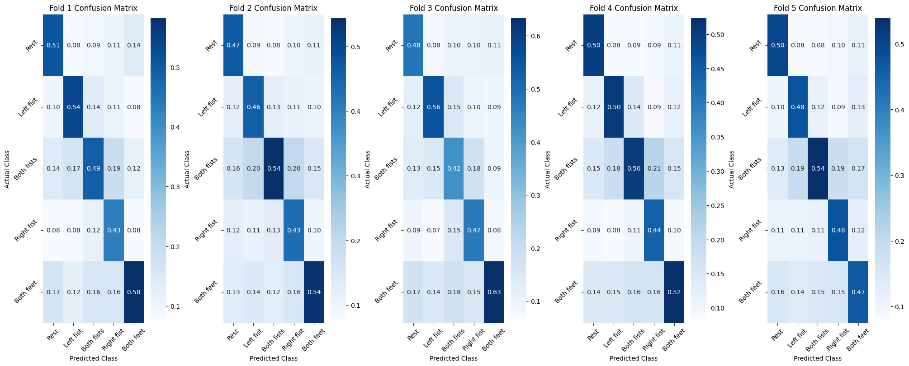

[Colab](https://colab.research.google.com/drive/1DasOYyrXmeAUCnT8sByn696Fb839nQ9q?usp=sharing)

# **INTRODUCTION**

The accurate identification of EEG signals is both challenging and time-consuming. However, utilizing EEG signals to identify motor or imagined movements can provide significant advantages for impaired individuals and offer new possibilities for healthy individuals. 

Our aim is to apply and optimize the EEGNet v4 model for classifying EEG signals related to motor and imagined movements. 

## **Dataset**

The dataset used in this project comprises over 1500 EEG recordings from 109 volunteers, collected using the BCI2000 system. The experimental protocol involved subjects performing various motor and imagery tasks while 64-channel EEGs were recorded. Each subject completed 14 runs:

- Two one-minute baseline runs (eyes open and eyes closed).

- Three two-minute runs of four different tasks:
    - **Task 1**: Open and close left or right fist.
    - **Task 2**: Imagine opening and closing left or right fist.
    - **Task 3**: Open and close both fists or both feet.
    - **Task 4**: Imagine opening and closing both fists or both feet.

The EEG signals were sampled at 160 Hz. Annotations indicate **rest (T0)**, cue for motion or imagined motion (**T1 for left fist or both fists**, **T2 for right fist or both feet**).

The data is in EDF+ format, with annotations. The EEGs were recorded from 64 electrodes following the international 10-10 system, excluding specific electrodes.

For more details please refer to **[EEGMMIDB](https://www.physionet.org/content/eegmmidb/1.0.0/)**
## **Data Processing**

The data processing involves reading EEG data from EDF files, filtering, and segmenting it into epochs. The key steps include:

- **Directory Setup**: The code expects a specific directory structure with EDF files organized by subject and run.

- **Reading and Filtering**: For each EDF file, the mne library is used to read the data, apply a notch filter at 60 Hz to remove powerline noise, and a high-pass filter at 2 Hz.

- **Epoch Creation**:

    - For baseline data (baseline_open, baseline_closed), fixed-length epochs of 60 seconds are created.

    - For task data (task_1 to task_4), epochs are created based on annotations within the EDF file. These epochs are 4.1 seconds long, matching the duration of the tasks.

- **Labeling**: Labels are assigned to each epoch based on the task type and event annotations.

- **Padding/Trimming**: Data is padded or trimmed to ensure all epochs have the same length.

- **Saving Data**: Processed data is saved as .pkl files for later use in model training.

## **Model**


&nbsp;


## **Model Training**

### **Cross-Validation Approach**

The model is trained using StratifiedKFold cross-validation to ensure each fold has a similar class distribution, reducing the risk of overfitting and providing a robust assessment of the model's performance. Specifically, the dataset is split into 5 folds:

- Each fold serves as a validation set once, while the remaining folds are used for training.
- This helps assess the model's performance across different subsets of data.

### **Model Implementation**

The implementation of EEGNet v4 model is from braindecode.

### **Training Process**

**Data Preparation**:

- EEG data is preprocessed, filtered, and segmented into epochs.
- The preprocessed data is loaded and split into training and testing sets based on the cross-validation indices.

**Model Initialization**:

- An instance of EEGNet v4 is created with parameters such as the number of **channels (64)**, the **number of output classes (5)**, and the **kernel length (32)**.
- The model weights are initialized using the **Glorot uniform initialization**, and biases are set to zero.

**Training Loop**:

- For each fold, the model is trained for **200 epochs** using the **Adam optimizer** and **cross-entropy loss**.
- The training process involves iterating over mini-batches of the training data, computing the loss, performing backpropagation, and updating the model weights.

**Evaluation**:

- After training each fold, the model's performance is evaluated on the validation set.
- Metrics such as accuracy, sensitivity, specificity, PPV, and NPV are calculated using confusion matrices.

**Model Saving**:

- The trained models for each fold are saved to disk for later use and comparison.

### **Testing**

After training with cross-validation, the models are evaluated on a separate test set comprising subjects after S095. The same metrics (accuracy, confusion matrix, sensitivity, specificity, PPV, and NPV) are calculated to assess the model's generalization performance.

This approach ensures a comprehensive evaluation of the EEGNet v4 model across different data splits, highlighting areas for improvement and providing a reliable measure of its classification capabilities.


# **RESULTS**

**Raw CMs**:


**Normalized CMs**:



# **DISCUSSION**

## **Discussion of Results**

The model's performance is inconsistent across different folds, particularly for the "Both fists" class. 

Here is a summary of the observations from each fold:

**Fold 1:**
- Significant confusion between the "Rest" and "Right fist" classes.
- High number of false negatives in the "Both fists" class.

**Fold 2:**
- High misclassification between the "Rest" and other classes.
- Considerable number of misclassifications in the "Both fists" and "Both feet" classes.

**Fold 3:**
- Extremely high misclassification rate for the "Both fists" class.
- Struggles to distinguish between the "Rest" and other classes.

**Fold 4:**
- High confusion between the "Rest" and "Left fist" classes.
- Significant number of misclassifications in the "Both fists" class.

**Fold 5:**
- Better performance compared to other folds with lower misclassification rates.
- Some confusion remains between the "Rest" and "Both feet" classes.

These results suggest that the model's performance is inconsistent across different folds, indicating the need for further investigation and improvement. The misclassifications and confusion between certain classes highlight the challenges in accurately identifying and distinguishing EEG signals.

It is important to note that EEG signals have limitations in measuring subcortical structures and capturing only large chunks of cortical activity. This limitation may cause some signals to cancel each other out, making it challenging to decisively identify and distinguish these signals. Therefore, alternative approaches may be required to improve the accuracy of EEG signal classification for motor or imagined movements.

## **Future Work**

**Separation of Motor and Imagined Tasks**: One potential avenue for future work is to separate the motor and imagined tasks and analyze their performance independently. This can provide insights into the specific challenges and differences in classifying motor and imagined movements. Another interesting direction for future work is to compare the results of classifying motor, imagined, and combined motor and imagined tasks. This can help identify any differences in performance and provide a better understanding of the capabilities and limitations of the model in different scenarios.


``` python
# preprocess.py

import os
import numpy as np
import mne
import pickle

# Directory where the data is stored
data_dir = 'data'  # Change this to your actual data directory

# Mapping of run indices to tasks/baselines
run_mapping = {
    1: 'baseline_open',
    2: 'baseline_closed',
    3: 'task_1',
    4: 'task_2',
    5: 'task_3',
    6: 'task_4',
    7: 'task_1',
    8: 'task_2',
    9: 'task_3',
    10: 'task_4',
    11: 'task_1',
    12: 'task_2',
    13: 'task_3',
    14: 'task_4'
}

# Mapping of event IDs to labels
event_id_mapping = {
    'T0': 1,  # Rest
    'T1_left': 2,  # Left fist
    'T1_both': 3,  # Both fists
    'T2_right': 4,  # Right fist
    'T2_both': 5  # Both feet
}

def process_run(edf_path, run_index, tmin=0, tmax=4.1):
    task_label = run_mapping.get(run_index, 'unknown')
    raw = mne.io.read_raw_edf(edf_path, preload=True)
    raw.notch_filter(freqs=60.0)  # powerline notch filter
    raw.filter(2, None, method='iir')  # High-pass filter at 2 Hz
    
    # Define event annotations
    events, event_id = mne.events_from_annotations(raw)
    labels = []
    epochs_data_list = []

    # Handle baselines differently since they are long T0 periods
    if task_label in ['baseline_open', 'baseline_closed']:
        tmin_baseline = 0  # start from the beginning
        tmax_baseline = 60  # 60 seconds for baseline
        epochs = mne.make_fixed_length_epochs(raw, duration=tmax_baseline, preload=True, overlap=0)
        epochs_data = epochs.get_data() * 1000  # Convert to microvolts

        labels = [event_id_mapping['T0']] * epochs_data.shape[0]  # Label all as T0
        if epochs_data.shape[0] > 0:  # Only append if there are valid epochs
            epochs_data_list.append(epochs_data)
    else:
        # Create epochs based on static tmin and tmax values
        epochs = mne.Epochs(raw, events, event_id, tmin=tmin, tmax=tmax, proj=False, baseline=(0,4.1), preload=True)
        epochs_data = epochs.get_data() * 1000  # Convert to microvolts

        for i, event in enumerate(epochs.events):
            if task_label in ['task_1', 'task_2']:
                if event[2] == event_id.get('T0'):
                    labels.append(event_id_mapping['T0'])
                elif event[2] == event_id.get('T1'):
                    labels.append(event_id_mapping['T1_left'])
                elif event[2] == event_id.get('T2'):
                    labels.append(event_id_mapping['T2_right'])
            elif task_label in ['task_3', 'task_4']:
                if event[2] == event_id.get('T0'):
                    labels.append(event_id_mapping['T0'])
                elif event[2] == event_id.get('T1'):
                    labels.append(event_id_mapping['T1_both'])
                elif event[2] == event_id.get('T2'):
                    labels.append(event_id_mapping['T2_both'])
            else:
                labels.append(event_id_mapping['T0'])
            print(labels)
        
        if epochs_data.shape[0] > 0:  # Only append if there are valid epochs
            epochs_data_list.append(epochs_data)
    
    return epochs_data_list, labels, task_label

def pad_or_trim(data, target_length):
    def pad(array):
        if array.shape[2] < target_length:
            pad_width = target_length - array.shape[2]
            return np.pad(array, ((0, 0), (0, 0), (0, pad_width)), mode='constant')
        return array[:, :, :target_length]
    
    return np.concatenate([pad(d) for d in data], axis=0)

def save_data(data_dir, tmin=0, tmax=4.1):
    subjects = [d for d in os.listdir(data_dir) if os.path.isdir(os.path.join(data_dir, d))]
    max_samples = int((tmax - tmin) * 160)  # Assuming a sampling rate of 160 Hz
    baseline_samples = 60 * 160  # Assuming 60 seconds for baselines

    for subject in subjects:
        subject_dir = os.path.join(data_dir, subject)
        edf_files = [f for f in os.listdir(subject_dir) if f.endswith('.edf')]
        
        for edf_file in edf_files:
            edf_path = os.path.join(subject_dir, edf_file)
            run_index = int(edf_file.split('R')[1].split('.')[0])  # Extract run index from filename
            epochs_data_list, labels, task_label = process_run(edf_path, run_index, tmin, tmax)
            
            if len(labels) > 0 and epochs_data_list:  # Only process if there are labels and epochs
                if task_label in ['baseline_open', 'baseline_closed']:
                    padded_data = pad_or_trim(epochs_data_list, baseline_samples)
                else:
                    padded_data = pad_or_trim(epochs_data_list, max_samples)
                
                labels = np.array(labels)

                # Create the save directory
                save_dir = os.path.join('preprocessed_data', subject, task_label)
                os.makedirs(save_dir, exist_ok=True)

                # Save the data for each run
                save_path = os.path.join(save_dir, f"run_{run_index}.pkl")
                with open(save_path, 'wb') as f:
                    pickle.dump({'X': padded_data, 'y': labels}, f)
                print(f"Saved {subject} - {task_label} - run {run_index} data.")

# Save preprocessed data for all subjects
save_data(data_dir)

print("All preprocessed data saved.")

```

``` python
# -*- coding: utf-8 -*-
"""iter_2.ipynb

Automatically generated by Colab.

Original file is located at
    https://colab.research.google.com/drive/1DasOYyrXmeAUCnT8sByn696Fb839nQ9q
"""

from google.colab import drive
drive.mount('/content/drive')

!nvidia-smi

import multiprocessing
num_cores = multiprocessing.cpu_count()
print(f"Number of CPU cores: {num_cores}")

!pip3 install torch --upgrade -q

!pip install numpy scikit-learn matplotlib visualkeras braindecode==0.8.1 skorch torchviz -q

# !python /content/drive/MyDrive/bme442/bme442project/preprocess.py

import numpy as np
import pickle
import mne
import pandas as pd

import torch
import torch.optim as optim
from torch import nn
from torch.nn.functional import elu
from torch.utils.data import DataLoader, Dataset
from torchsummary import summary
from torchviz import make_dot

from braindecode.models.base import EEGModuleMixin, deprecated_args
from braindecode.models.functions import squeeze_final_output
from braindecode.models.modules import Ensure4d, Expression

from skorch import NeuralNetClassifier
from skorch.callbacks import LRScheduler, TrainEndCheckpoint

from sklearn.model_selection import StratifiedKFold
from sklearn.metrics import confusion_matrix, ConfusionMatrixDisplay, accuracy_score

from einops.layers.torch import Rearrange

import matplotlib.pyplot as plt
import os
import concurrent.futures
import logging
import time
from tqdm import tqdm
import seaborn as sns

cuda = torch.cuda.is_available()

logging.basicConfig(level=logging.INFO, format='%(asctime)s - %(levelname)s - %(message)s')
base_dir = '/content/drive/MyDrive/bme442/bme442project'
preprocessed_data_dir = os.path.join(base_dir, 'preprocessed_data')

# someList = []
# with open('/content/drive/MyDrive/bme442/bme442project/preprocessed_data/S001/task_2/run_4.pkl', 'rb') as f:
#     data = pickle.load(f)
#     print('X: ', data['X'])
#     # someList.append(data['X'][28])
#     print('y: ', data['y'])

# # print(someList)

def process_run(run_path, test_flag):
    logging.info(f"Processing file: {run_path}")
    with open(run_path, 'rb') as f:
        data = pickle.load(f)

        # Get indices of all `1`s in `data['y']`
        one_indices = [i for i, y in enumerate(data['y']) if y == 1]

        # Create a set of indices to filter out: 4 out of every 5 `1`s
        filter_indices = set(one_indices[1::5] + one_indices[2::5] + one_indices[3::5] + one_indices[4::5])

        # Filter data
        filtered_X = [x for i, x in enumerate(data['X']) if i not in filter_indices]
        filtered_y = [y for i, y in enumerate(data['y']) if i not in filter_indices]

        if test_flag:
            return filtered_X, filtered_y, 'test'
        else:
            return filtered_X, filtered_y, 'train'

def process_subject(subject):
    global test_flag
    subject_dir = os.path.join(preprocessed_data_dir, subject)
    tasks = ['task_1', 'task_2', 'task_3', 'task_4']
    results = []

    if subject == 'S095':
        test_flag = True

    if os.path.isdir(subject_dir):
        for task in tasks:
            task_dir = os.path.join(subject_dir, task)
            if os.path.isdir(task_dir):
                for run_file in os.listdir(task_dir):
                    if run_file.endswith('.pkl'):
                        run_path = os.path.join(task_dir, run_file)
                        results.append((run_path, test_flag))

    return results

test_flag = False
X_combined = []
y_combined = []
X_combined_test = []
y_combined_test = []
all_runs = []
counter = 0

# Process all subjects concurrently
with concurrent.futures.ThreadPoolExecutor() as subject_executor:
    subject_futures = {subject_executor.submit(process_subject, subject): subject for subject in os.listdir(preprocessed_data_dir)}

    for future in tqdm(concurrent.futures.as_completed(subject_futures), total=len(subject_futures), desc="Processing subjects"):
        try:
            subject_runs = future.result()
            all_runs.extend(subject_runs)
        except Exception as e:
            subject = subject_futures[future]
            print(f"Error processing subject {subject}: {e}")

# Process all runs concurrently
with concurrent.futures.ThreadPoolExecutor() as executor:
    futures = []
    for run_path, flag in all_runs:
        futures.append(executor.submit(process_run, run_path, flag))

    for future in tqdm(concurrent.futures.as_completed(futures), total=len(futures), desc="Processing runs"):
        filtered_X, filtered_y, dataset_type = future.result()
        if dataset_type == 'test':
            X_combined_test.extend(filtered_X)
            y_combined_test.extend(filtered_y)
        else:
            X_combined.extend(filtered_X)
            y_combined.extend(filtered_y)

# Subtract one from every y value
y_combined = [y - 1 for y in y_combined]
y_combined_test = [y - 1 for y in y_combined_test]

y_combined = np.array(y_combined)
X_combined = np.array(X_combined)
y_combined_test = np.array(y_combined_test)
X_combined_test = np.array(X_combined_test)

y_combined.shape, X_combined.shape, y_combined_test.shape, X_combined_test.shape

print("X_combined shape:", X_combined.shape)
print("y_combined shape:", y_combined.shape)

unique, counts = np.unique(y_combined, return_counts=True)
print(dict(zip(unique, counts)))

if X_combined.shape[0] != y_combined.shape[0]:
    raise ValueError("Mismatch between number of samples in X_combined and y_combined.")

if X_combined_test.shape[0] != y_combined_test.shape[0]:
    raise ValueError("Mismatch between number of samples in X_combined_test and y_combined_test.")

class Conv2dWithConstraint(nn.Conv2d):
    def __init__(self, *args, max_norm=1, **kwargs):
        self.max_norm = max_norm
        super(Conv2dWithConstraint, self).__init__(*args, **kwargs)

    def forward(self, x):
        self.weight.data = torch.renorm(
            self.weight.data, p=2, dim=0, maxnorm=self.max_norm
        )
        return super(Conv2dWithConstraint, self).forward(x)

def _glorot_weight_zero_bias(model):
    """Initialize parameters of all modules by initializing weights with
    glorot
     uniform/xavier initialization, and setting biases to zero. Weights from
     batch norm layers are set to 1.

    Parameters
    ----------
    model: Module
    """
    for module in model.modules():
        if hasattr(module, "weight"):
            if "BatchNorm" not in module.__class__.__name__:
                nn.init.xavier_uniform_(module.weight, gain=1)
            else:
                nn.init.constant_(module.weight, 1)
        if hasattr(module, "bias"):
            if module.bias is not None:
                nn.init.constant_(module.bias, 0)

# Set up logging configuration
logging.basicConfig(level=logging.INFO, format='%(asctime)s - %(levelname)s - %(message)s')
logger = logging.getLogger(__name__)

class EEGNetv4(EEGModuleMixin, nn.Sequential):
    """EEGNet v4 model from Lawhern et al 2018.

    See details in [EEGNet4]_.

    Parameters
    ----------
    final_conv_length : int | "auto"
        If int, final length of convolutional filters.
    in_chans :
        Alias for n_chans.
    n_classes:
        Alias for n_outputs.
    input_window_samples :
        Alias for n_times.

    Notes
    -----
    This implementation is not guaranteed to be correct, has not been checked
    by original authors, only reimplemented from the paper description.

    References
    ----------
    .. [EEGNet4] Lawhern, V. J., Solon, A. J., Waytowich, N. R., Gordon,
       S. M., Hung, C. P., & Lance, B. J. (2018).
       EEGNet: A Compact Convolutional Network for EEG-based
       Brain-Computer Interfaces.
       arXiv preprint arXiv:1611.08024.
    """

    def __init__(
        self,
        n_chans=None,
        n_outputs=None,
        n_times=None,
        final_conv_length="auto",
        pool_mode="mean",
        F1=8,
        D=2,
        F2=16,  # usually set to F1*D (?)
        kernel_length=64,
        third_kernel_size=(8, 4),
        drop_prob=0.25,
        chs_info=None,
        input_window_seconds=None,
        sfreq=None,
        in_chans=None,
        n_classes=None,
        input_window_samples=None,
    ):
        n_chans, n_outputs, n_times = deprecated_args(
            self,
            ("in_chans", "n_chans", in_chans, n_chans),
            ("n_classes", "n_outputs", n_classes, n_outputs),
            ("input_window_samples", "n_times", input_window_samples, n_times),
        )
        super().__init__(
            n_outputs=n_outputs,
            n_chans=n_chans,
            chs_info=chs_info,
            n_times=n_times,
            input_window_seconds=input_window_seconds,
            sfreq=sfreq,
        )
        del n_outputs, n_chans, chs_info, n_times, input_window_seconds, sfreq
        del in_chans, n_classes, input_window_samples
        if final_conv_length == "auto":
            assert self.n_times is not None
        self.final_conv_length = final_conv_length
        self.pool_mode = pool_mode
        self.F1 = F1
        self.D = D
        self.F2 = F2
        self.kernel_length = kernel_length
        self.third_kernel_size = third_kernel_size
        self.drop_prob = drop_prob
        # For the load_state_dict
        # When padronize all layers,
        # add the old's parameters here
        self.mapping = {
            "conv_classifier.weight": "final_layer.conv_classifier.weight",
            "conv_classifier.bias": "final_layer.conv_classifier.bias",
        }

        pool_class = dict(max=nn.MaxPool2d, mean=nn.AvgPool2d)[self.pool_mode]
        self.add_module("ensuredims", Ensure4d())

        self.add_module("dimshuffle", Rearrange("batch ch t 1 -> batch 1 ch t"))
        self.add_module(
            "conv_temporal",
            nn.Conv2d(
                1,
                self.F1,
                (1, self.kernel_length),
                stride=1,
                bias=False,
                padding=(0, self.kernel_length // 2),
            ),
        )
        self.add_module(
            "bnorm_temporal",
            nn.BatchNorm2d(self.F1, momentum=0.01, affine=True, eps=1e-3),
        )
        self.add_module(
            "conv_spatial",
            Conv2dWithConstraint(
                self.F1,
                self.F1 * self.D,
                (self.n_chans, 1),
                max_norm=1,
                stride=1,
                bias=False,
                groups=self.F1,
                padding=(0, 0),
            ),
        )

        self.add_module(
            "bnorm_1",
            nn.BatchNorm2d(self.F1 * self.D, momentum=0.01, affine=True, eps=1e-3),
        )
        self.add_module("elu_1", Expression(elu))

        self.add_module("pool_1", pool_class(kernel_size=(1, 4), stride=(1, 4)))
        self.add_module("drop_1", nn.Dropout(p=self.drop_prob))

        # https://discuss.pytorch.org/t/how-to-modify-a-conv2d-to-depthwise-separable-convolution/15843/7
        self.add_module(
            "conv_separable_depth",
            nn.Conv2d(
                self.F1 * self.D,
                self.F1 * self.D,
                (1, 16),
                stride=1,
                bias=False,
                groups=self.F1 * self.D,
                padding=(0, 16 // 2),
            ),
        )
        self.add_module(
            "conv_separable_point",
            nn.Conv2d(
                self.F1 * self.D,
                self.F2,
                (1, 1),
                stride=1,
                bias=False,
                padding=(0, 0),
            ),
        )

        self.add_module(
            "bnorm_2",
            nn.BatchNorm2d(self.F2, momentum=0.01, affine=True, eps=1e-3),
        )
        self.add_module("elu_2", Expression(elu))
        self.add_module("pool_2", pool_class(kernel_size=(1, 8), stride=(1, 8)))
        self.add_module("drop_2", nn.Dropout(p=self.drop_prob))

        output_shape = self.get_output_shape()
        n_out_virtual_chans = output_shape[2]

        if self.final_conv_length == "auto":
            n_out_time = output_shape[3]
            self.final_conv_length = n_out_time

        # Incorporating classification module and subsequent ones in one final layer
        module = nn.Sequential()

        module.add_module(
            "conv_classifier",
            nn.Conv2d(
                self.F2,
                self.n_outputs,
                (n_out_virtual_chans, self.final_conv_length),
                bias=True,
            ),
        )

        if self.add_log_softmax:
            module.add_module("logsoftmax", nn.LogSoftmax(dim=1))

        # Transpose back to the logic of braindecode,
        # so time in third dimension (axis=2)
        module.add_module(
            "permute_back",
            Rearrange("batch x y z -> batch x z y"),
        )

        module.add_module("squeeze", Expression(squeeze_final_output))

        self.add_module("final_layer", module)

        _glorot_weight_zero_bias(self)

    def forward(self, x):
        logger.info(f'Input shape: {x.shape}')
        x = super().forward(x)
        logger.info(f'Output shape: {x.shape}')
        return x

# Ensure device is correctly set
device = torch.device("cuda" if torch.cuda.is_available() else "cpu")

# Step 1: Check for NaN or infinite values in the data
assert not np.isnan(X_combined).any(), "X_combined contains NaN values"
assert not np.isinf(X_combined).any(), "X_combined contains infinite values"
assert not np.isnan(y_combined).any(), "y_combined contains NaN values"
assert not np.isinf(y_combined).any(), "y_combined contains infinite values"

# Step 2: Convert to PyTorch tensors on CPU first
X_combined_tensor_cpu = torch.from_numpy(X_combined).float()
y_combined_tensor_cpu = torch.from_numpy(y_combined).long()

# Check the tensors on CPU
print(f"Shape of X_combined_tensor_cpu: {X_combined_tensor_cpu.shape}")
print(f"Shape of y_combined_tensor_cpu: {y_combined_tensor_cpu.shape}")

# Test with a small batch
small_batch_X = X_combined_tensor_cpu[:10]
small_batch_y = y_combined_tensor_cpu[:10]

try:
    small_batch_X_cuda = small_batch_X.to(device)
    small_batch_y_cuda = small_batch_y.to(device)
    print("Small batch transfer successful")
except RuntimeError as e:
    print(f"Error during small batch transfer: {e}")

# Inspect the data for unusual values
print("X_combined max:", X_combined.max())
print("X_combined min:", X_combined.min())
print("X_combined mean:", X_combined.mean())

print("y_combined unique values:", np.unique(y_combined))

# Enable CUDA debugging mode
os.environ['CUDA_LAUNCH_BLOCKING'] = "1"

# Move the tensors to the CUDA device again
try:
    X_combined_tensor = X_combined_tensor_cpu.to(device)
    y_combined_tensor = y_combined_tensor_cpu.to(device)
    print("Data transfer to CUDA successful")
except RuntimeError as e:
    print(f"Error during data transfer to CUDA: {e}")


def process_fold(train_index, test_index, X_combined, y_combined, batch_size=128):
    print("process_fold called")
    assert torch.cuda.is_available(), "CUDA is not available. Check your GPU setup."
    torch.backends.cudnn.enabled = False  # Disable cuDNN for debugging purposes

    device = torch.device('cuda' if torch.cuda.is_available() else 'cpu')
    logger.info(f"Using device: {device}")

    X_train, X_test = X_combined[train_index], X_combined[test_index]
    y_train, y_test = y_combined[train_index], y_combined[test_index]

    # Check for NaN or infinite values in the data
    assert not np.isnan(X_train).any(), "X_train contains NaN values"
    assert not np.isinf(X_train).any(), "X_train contains infinite values"
    assert not np.isnan(X_test).any(), "X_test contains NaN values"
    assert not np.isinf(X_test).any(), "X_test contains infinite values"
    assert not np.isnan(y_train).any(), "y_train contains NaN values"
    assert not np.isinf(y_train).any(), "y_train contains infinite values"
    assert not np.isnan(y_test).any(), "y_test contains NaN values"
    assert not np.isinf(y_test).any(), "y_test contains infinite values"

    # Convert data to PyTorch tensors
    X_train_tensor_cpu = torch.from_numpy(X_train).float()
    X_test_tensor_cpu = torch.from_numpy(X_test).float()
    y_train_tensor_cpu = torch.from_numpy(y_train).long()
    y_test_tensor_cpu = torch.from_numpy(y_test).long()

    # Transfer full tensors to the CUDA device
    X_train = X_train_tensor_cpu.to(device)
    X_test = X_test_tensor_cpu.to(device)
    y_train = y_train_tensor_cpu.to(device)
    y_test = y_test_tensor_cpu.to(device)

    # Define the model
    model = EEGNetv4(n_chans=64, n_outputs=5, n_times=656, kernel_length=32)
    model = model.to(device)

    # Define the loss function and optimizer
    criterion = nn.CrossEntropyLoss()
    optimizer = optim.Adam(model.parameters(), lr=0.05, capturable=False)  # capturable=False to avoid CUDA assertion

    # Training loop
    def train_model(model, criterion, optimizer, X_train, y_train, n_epochs=200, batch_size=128):
        model.train()
        dataset = torch.utils.data.TensorDataset(X_train, y_train)
        dataloader = torch.utils.data.DataLoader(dataset, batch_size=batch_size, shuffle=True)

        for epoch in range(n_epochs):
            epoch_start_time = time.time()
            running_loss = 0.0
            for batch_idx, (inputs, labels) in enumerate(dataloader):
                batch_start_time = time.time()
                inputs, labels = inputs.to(device), labels.to(device)

                optimizer.zero_grad()
                outputs = model(inputs)
                loss = criterion(outputs, labels)
                loss.backward()
                optimizer.step()

                running_loss += loss.item()

                batch_end_time = time.time()
                print(f'Batch {batch_idx + 1}/{len(dataloader)} processed in {batch_end_time - batch_start_time:.4f} seconds')

            avg_loss = running_loss / len(dataloader)
            epoch_end_time = time.time()
            logger.info(f'Epoch [{epoch + 1}/{n_epochs}] completed in {epoch_end_time - epoch_start_time:.4f} seconds, Average Loss: {avg_loss:.4f}')

    logger.info('Starting model training...')
    print('Starting model training...')
    train_model(model, criterion, optimizer, X_train, y_train, batch_size=batch_size)
    logger.info('Model training completed.')
    print('Model training completed.')

    # Predict and evaluate
    logger.info('Starting prediction...')
    print('Starting prediction...')
    model.eval()
    with torch.no_grad():
        outputs = model(X_test)
        _, y_pred = torch.max(outputs, 1)

    y_pred = y_pred.cpu().numpy()
    accuracy = accuracy_score(y_test.cpu().numpy(), y_pred)
    logger.info(f'Fold accuracy: {accuracy:.4f}')
    print(f'Fold accuracy: {accuracy:.4f}')

    # Generate confusion matrix
    cm = confusion_matrix(y_test.cpu().numpy(), y_pred)
    logger.info(f'Confusion Matrix:\n{cm}')
    print(f'Confusion Matrix:\n{cm}')

    # Calculate sensitivities, specificities, PPVs, and NPVs
    fold_sensitivities = []
    fold_specificities = []
    fold_ppvs = []
    fold_npvs = []

    for i in range(5):
        tp = cm[i, i]
        fn = cm[i, :].sum() - tp
        fp = cm[:, i].sum() - tp
        tn = cm.sum() - (tp + fn + fp)

        sensitivity = tp / (tp + fn) if (tp + fn) > 0 else 0
        specificity = tn / (tn + fp) if (tn + fp) > 0 else 0
        ppv = tp / (tp + fp) if (tp + fp) > 0 else 0
        npv = tn / (tn + fn) if (tn + fn) > 0 else 0

        fold_sensitivities.append(sensitivity)
        fold_specificities.append(specificity)
        fold_ppvs.append(ppv)
        fold_npvs.append(npv)

    logger.info(f'Fold sensitivities: {fold_sensitivities}')
    print(f'Fold sensitivities: {fold_sensitivities}')
    logger.info(f'Fold specificities: {fold_specificities}')
    print(f'Fold specificities: {fold_specificities}')
    logger.info(f'Fold PPVs: {fold_ppvs}')
    print(f'Fold PPVs: {fold_ppvs}')
    logger.info(f'Fold NPVs: {fold_npvs}')
    print(f'Fold NPVs: {fold_npvs}')

    return model, fold_sensitivities, fold_specificities, fold_ppvs, fold_npvs, cm

skf = StratifiedKFold(n_splits=5, shuffle=True, random_state=42)
all_sensitivities = []
all_specificities = []
all_ppvs = []
all_npvs = []
models = []
cms = []

# Check if the trained_models directory exists and create if it doesn't
os.makedirs(os.path.join(base_dir, 'trained_models'), exist_ok=True)

# Check for existing models
existing_models = os.listdir(os.path.join(base_dir, "trained_models"))

if existing_models:
    print("Loading existing models...")
    for fold_index, model_file in enumerate(existing_models, start=1):
        model_path = os.path.join(base_dir, 'trained_models', model_file)
        model = EEGNetv4(n_chans=64, n_outputs=5, n_times=656, kernel_length=32)
        model.load_state_dict(torch.load(model_path))
        models.append(model)
        print(f"Loaded model for fold {fold_index}")
else:
    print("Starting StratifiedKFold cross-validation")

    fold_index = 1

    for train_index, test_index in skf.split(X_combined, y_combined):
        print(f"Processing fold {fold_index}")
        model, sensitivities, specificities, ppvs, npvs, cm = process_fold(train_index, test_index, X_combined, y_combined, batch_size=2048)
        if sensitivities and specificities and ppvs and npvs:
            all_sensitivities.append(sensitivities)
            all_specificities.append(specificities)
            all_ppvs.append(ppvs)
            all_npvs.append(npvs)
        models.append(model)
        cms.append(cm)
        model_save_path = os.path.join(base_dir, 'trained_models', f'model_fold_{fold_index}.pth')
        torch.save(model.state_dict(), model_save_path)
        print(f"Completed fold {fold_index}")
        fold_index += 1

    print("Completed StratifiedKFold cross-validation")

# Convert lists to numpy arrays for further analysis
all_sensitivities = np.array(all_sensitivities)
all_specificities = np.array(all_specificities)
all_ppvs = np.array(all_ppvs)
all_npvs = np.array(all_npvs)

print(f'Mean Sensitivities per fold: {all_sensitivities.mean(axis=0)}')
print(f'Mean Specificities per fold: {all_specificities.mean(axis=0)}')
print(f'Mean PPVs per fold: {all_ppvs.mean(axis=0)}')
print(f'Mean NPVs per fold: {all_npvs.mean(axis=0)}')

# Assuming you have these variables defined
device = torch.device('cuda' if torch.cuda.is_available() else 'cpu')

# Test the resulting models with y_combined_test and X_combined_test
X_combined_test_tensor = torch.from_numpy(X_combined_test).float().to(device)
y_combined_test_tensor = torch.from_numpy(y_combined_test).long().to(device)

all_test_sensitivities = []
all_test_specificities = []
all_test_ppvs = []
all_test_npvs = []
test_cms = []

cms = []

for i, model in enumerate(models, 1):
    model.to(device)  # Ensure the model is on the same device as the input
    model.eval()
    with torch.no_grad():
        outputs = model(X_combined_test_tensor)
        _, y_pred = torch.max(outputs, 1)

    y_pred = y_pred.cpu().numpy()
    cm = confusion_matrix(y_combined_test, y_pred)
    cms.append(cm)
    test_cms.append(cm)
    print(f'Confusion Matrix for model {i}:\n{cm}')
    # torch.save(model.state_dict(), os.path.join(base_dir, 'trained_models', f'model_test_{i}.pth'))

    # Calculate sensitivities, specificities, PPVs, and NPVs
    test_sensitivities = []
    test_specificities = []
    test_ppvs = []
    test_npvs = []

    for j in range(len(cm)):  # Adjusted to use len(cm) for the range
        tp = cm[j, j]
        fn = cm[j, :].sum() - tp
        fp = cm[:, j].sum() - tp
        tn = cm.sum() - (tp + fn + fp)

        sensitivity = tp / (tp + fn) if (tp + fn) > 0 else 0
        specificity = tn / (tn + fp) if (tn + fp) > 0 else 0
        ppv = tp / (tp + fp) if (tp + fp) > 0 else 0
        npv = tn / (tn + fn) if (tn + fn) > 0 else 0

        test_sensitivities.append(sensitivity)
        test_specificities.append(specificity)
        test_ppvs.append(ppv)
        test_npvs.append(npv)

    all_test_sensitivities.append(test_sensitivities)
    all_test_specificities.append(test_specificities)
    all_test_ppvs.append(test_ppvs)
    all_test_npvs.append(test_npvs)

print("Completed testing models on the test set")

# Convert the confusion matrices to pandas DataFrames
df_cms = []
for i, cm in enumerate(cms, 1):
    df_cm = pd.DataFrame(cm, columns=[f'Predicted Class {i}' for i in range(5)], index=[f'Actual Class {i}' for i in range(5)])
    df_cms.append(df_cm)

# Define the class names
class_names = ['Rest', 'Left fist', 'Both fists', 'Right fist', 'Both feet']

# Create a figure with subplots for each fold, adjusting layout and size
fig, axes = plt.subplots(1, len(df_cms), figsize=(20, 8), constrained_layout=True)

# Plot each confusion matrix
for i, df_cm in enumerate(df_cms, 1):
    sns.heatmap(df_cm, annot=True, fmt='g', cmap='Blues', ax=axes[i-1], xticklabels=class_names, yticklabels=class_names)
    axes[i-1].set_xlabel('Predicted Class')
    axes[i-1].set_ylabel('Actual Class')
    axes[i-1].set_title(f'Fold {i} Confusion Matrix')
    axes[i-1].tick_params(axis='x', rotation=45)
    axes[i-1].tick_params(axis='y', rotation=45)

plt.show()

all_test_sensitivities = np.array(all_test_sensitivities)
all_test_specificities = np.array(all_test_specificities)
all_test_ppvs = np.array(all_test_ppvs)
all_test_npvs = np.array(all_test_npvs)

all_test_accuracies = (all_test_sensitivities + all_test_specificities) / 2

print(f'Mean Test Sensitivities: {all_test_sensitivities.mean(axis=0)}')
print(f'Mean Test Specificities: {all_test_specificities.mean(axis=0)}')
print(f'Mean Test PPVs: {all_test_ppvs.mean(axis=0)}')
print(f'Mean Test NPVs: {all_test_npvs.mean(axis=0)}')

# Convert to DataFrames with class names as indices
df_sensitivities = pd.DataFrame(all_test_sensitivities * 100, index=class_names, columns=[f'Fold {i+1}' for i in range(all_test_sensitivities.shape[1])])
df_specificities = pd.DataFrame(all_test_specificities * 100, index=class_names, columns=[f'Fold {i+1}' for i in range(all_test_specificities.shape[1])])
df_ppvs = pd.DataFrame(all_test_ppvs * 100, index=class_names, columns=[f'Fold {i+1}' for i in range(all_test_ppvs.shape[1])])
df_npvs = pd.DataFrame(all_test_npvs * 100, index=class_names, columns=[f'Fold {i+1}' for i in range(all_test_npvs.shape[1])])
df_accuracies = pd.DataFrame(all_test_accuracies * 100, index=class_names, columns=[f'Fold {i+1}' for i in range(all_test_accuracies.shape[1])])


# Print the tables
print("Test Sensitivities by Fold")
print(df_sensitivities)
print("\nTest Specificities by Fold")
print(df_specificities)
print("\nTest PPVs by Fold")
print(df_ppvs)
print("\nTest NPVs by Fold")
print(df_npvs)
print("\nTest Accuracies by Fold")
print(df_accuracies)

def display_table(df, title):
    df_formatted = df.round(2).astype(str) + '%'
    fig, ax = plt.subplots(figsize=(10, len(df) * 0.5 + 1))  # Adjust the size as needed
    ax.axis('tight')
    ax.axis('off')
    table = ax.table(cellText=df_formatted.values, colLabels=df_formatted.columns, rowLabels=df_formatted.index, cellLoc='center', loc='center')
    ax.set_title(title)
    plt.show()

# Display each DataFrame as an image
display_table(df_sensitivities, 'Test Sensitivities by Fold')
display_table(df_specificities, 'Test Specificities by Fold')
display_table(df_ppvs, 'Test PPVs by Fold')
display_table(df_npvs, 'Test NPVs by Fold')
display_table(df_accuracies, 'Test Accuracies by Fold')

# Convert confusion matrices to numpy arrays if they are not already
df_cms = [np.array(cm) for cm in df_cms]

# Normalize the confusion matrices along the columns
df_cms_normalized = [cm.astype('float') / cm.sum(axis=0)[np.newaxis, :] for cm in df_cms]

# Define the class names
class_names = ['Rest', 'Left fist', 'Both fists', 'Right fist', 'Both feet']

# Create a figure with subplots for each fold, adjusting layout and size
fig, axes = plt.subplots(1, len(df_cms_normalized), figsize=(20, 8), constrained_layout=True)

# Plot each normalized confusion matrix
for i, df_cm in enumerate(df_cms_normalized, 1):
    sns.heatmap(df_cm, annot=True, fmt='.2f', cmap='Blues', ax=axes[i-1], xticklabels=class_names, yticklabels=class_names)
    axes[i-1].set_xlabel('Predicted Class')
    axes[i-1].set_ylabel('Actual Class')
    axes[i-1].set_title(f'Fold {i} Confusion Matrix')
    axes[i-1].tick_params(axis='x', rotation=45)
    axes[i-1].tick_params(axis='y', rotation=45)

plt.show()
```