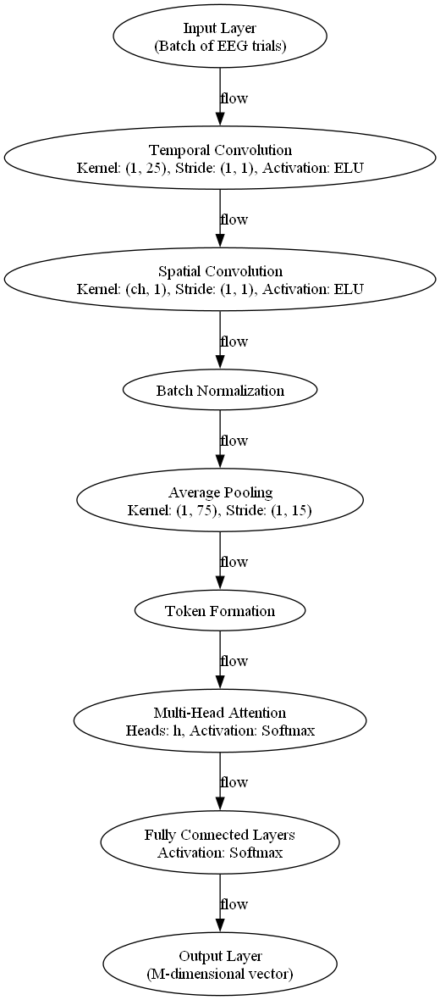

README
=======

This repository contains code for preprocessing EEG data from the OpenNeuro dataset ds003825.

**Dependencies**

- Python 3.x
- MNE library (version 0.24.1 or later)
- NumPy library (version 1.20.0 or later)
- Pandas library (version 1.3.5 or later)
- Graphviz library (for neural network visualization)
- Logging library (for output management)

**Usage**

1. Clone the repository and navigate to the root directory.
2. Run the `preprocessing_things` function by calling `python preprocessing_things.py <partid>`, where `<partid>` is the participant ID (e.g., 2).
3. The script will preprocess the EEG data for the specified participant and save the results to a file.

**Files**

* `preprocessing_things.py`: Main script for preprocessing EEG data.
* `model.py`: Script for visualizing EEG Conformer network architecture.
* `data/`: Directory containing the EEG data files.
* `data/derivatives/mne/`: Directory containing the preprocessed EEG data files.
* `plots/`: Directory containing generated plots of the EEG data.

**Notes**

* The script assumes that the EEG data files are stored in the `data/` directory, with the filename format `sub-<partid>_task-rsvp_eeg.vhdr`.
* The script uses the MNE library to read and preprocess the EEG data.
* The preprocessed EEG data is saved to a file in the `data/derivatives/mne/` directory, with the filename format `sub-<partid>_task-rsvp-epo.fif`.
* The script also generates plots of the preprocessed EEG data, including a sample of the raw data, the average of the epochs data, and the power spectral density of the epochs data.

**Neural Network Architecture**

**Architecture Details:**

**Architecture Details:**

- **Input Layer**: Handles preprocessed EEG trials, feeding them into the network.

- **Temporal Convolution**: 
  - **Kernel Size**: (1, 25)
  - **Activation**: ELU
  - **Purpose**: Captures temporal patterns within EEG signals.

- **Spatial Convolution**: 
  - **Kernel Size**: (ch, 1)
  - **Activation**: ELU
  - **Purpose**: Extracts spatial relationships across EEG channels.

- **Batch Normalization**: Facilitates faster and more stable training by normalizing layer outputs.

- **Average Pooling**: 
  - **Kernel Size**: (1, 75), **Stride**: (1, 15)
  - **Purpose**: Reduces data dimensions and computational burden, maintaining essential features.

- **Token Formation**: Organizes pooled features into tokens, preparing them for attention processing.

- **Multi-Head Attention**:
  - **Activation**: Softmax
  - **Components**: Transforms tokens into Query (Q), Key (K), and Value (V) matrices, calculates attention scores through scaled dot products, and applies these scores to the values for dynamic feature focus.

- **Fully Connected Layers**: 
  - **Activation**: Softmax
  - **Purpose**: Maps attention-augmented features to the output categories.

- **Output Layer**: Outputs final predictions in an M-dimensional vector format, corresponding to the classified EEG categories.

**License**

This code is licensed under the MIT License. See the `LICENSE` file for details.